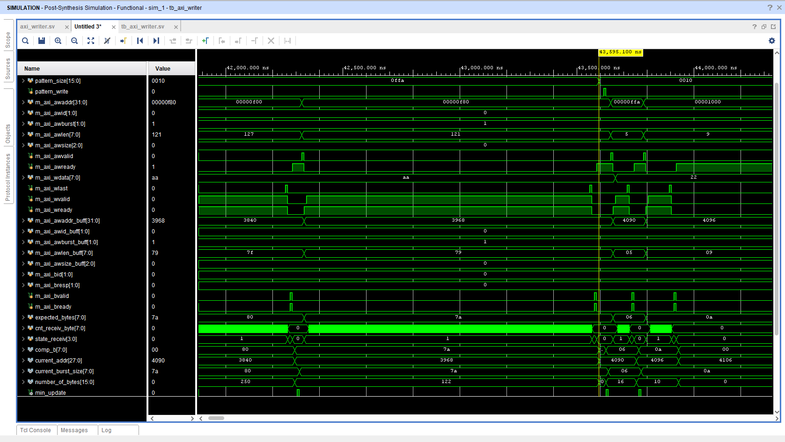
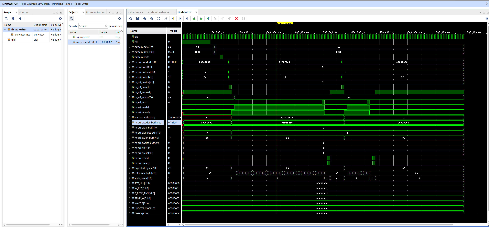
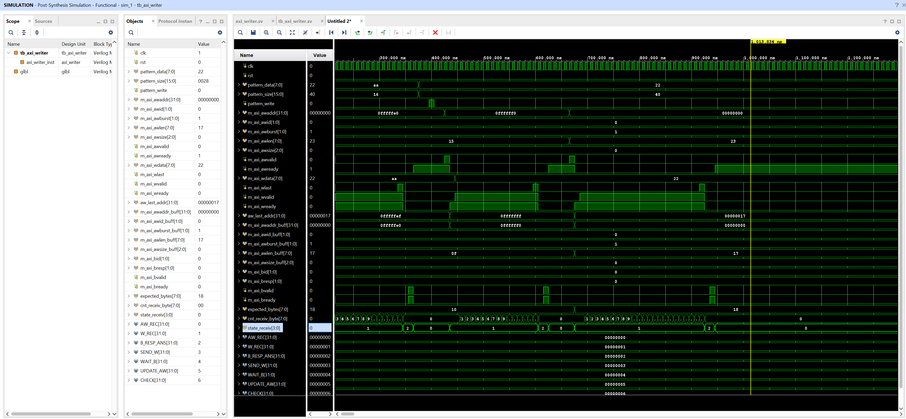

# Модуль AXI Writer

### Описание проекта

Проект содержит синтезируемое SystemVerilog IP-ядро axi\_writer, выполняющее запись блока данных в память по AXI-интерфейсу (только операции записи).

#### Основные параметры

Тактовая частота проекта: 100 МГц.

Размер памяти: 256 MB.

Максимальный размер берста 128.

#### Структура проекта

test\_project.srcs/

&#x09;	source\_1/

&#x20;   			axi\_writer.sv

&#x09;	sim\_1/

&#x20;   			tb\_axi\_writer.sv

### Логика работы

1\. После сброса модуль находится в состоянии ожидания.

2\. При поступлении pattern\_write модуль сохраняет pattern\_data и pattern\_size.

3\. Если pattern\_size больше нуля, начинается запись блока в память.

4\. Запись разбивается на AXI burst-транзакции.

5\. Размер каждого burst выбирается с учётом:

&#x09;а)оставшегося количества байт;

&#x09;б)максимального размера burst;

&#x20;  	в)ограничения AXI 4 KB boundary;

&#x20;  	г)конца циклического буфера 256 MB.

6\. После достижения конца памяти следующий адрес записи становится равным нулю.

7\. После завершения всей команды модуль возвращается в состояние ожидания.

### Проверки в тестбенче

В тестбенче реализована модель AXI slave и проверки корректности AXI Write-передач.

Проверяются следующие сценарии:

1. запись блока, разбиваемого на несколько burst-транзакций;

2\. корректное ограничение burst по AXI 4 KB boundary;

3\. переполнение циклического буфера 256 MB и продолжение записи с нулевого адреса;

5\. рандомизация pattern\_size и pattern\_data.

### Запуск симуляции в Vivado

1\. Открыть проект в Vivado через запуск test\_project.xpr.

2\. Убедиться, что файл axi\_writer добавлен в Design Sources.

3\. Убедиться, что файл tb\_axi\_writer добавлен в Simulation Sources.

4\. Проверисти синтез схемы через Run Synthesis

4\. Выбрать тестбенч tb\_axi\_writer как top module для симуляции.

5\. Запустить Run Simulation → Run Post-Synthesis Functioal Simulation.

6\. Настроить число тестов count\_test (по умолчанию стоит 10) (Также есть возможность настроить диапазон значений pattern\_size через rand\_size\_max)

6\. Проверить консоль симуляции. При успешном прохождении тестов не должно быть сообщений $error.

### Ожидаемый результат

При корректной работе модуля в консоли симуляции должны отображаться сообщения о запуске тестов и завершении random-тестов без ошибок.

Пример успешного завершения:

Random test 0: data=rand size=rand

Random test i: data=rand size=rand 

Random tests finished

где rand это значения, меняющиеся от реализации к реализации

### Результаты тестирования

Рис.1. Проверка AXI 4K Boundary

Рис.2. Проверка Циклического буфера с разбиением одной транзакции записи данных

Рис. 3. Проверка Циклического буфера с двумя транзакциями записи данных

### Примечания

Порт addr_debug может использоваться в тестбенче для проверки поведения модуля около конца циклического буфера. В рабочей конфигурации начальный адрес равен нулю.
Отладка на плате SITILINV представлена в проекте project_ddr 
