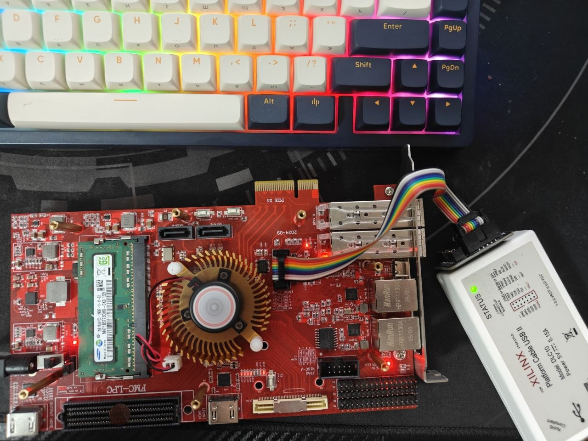
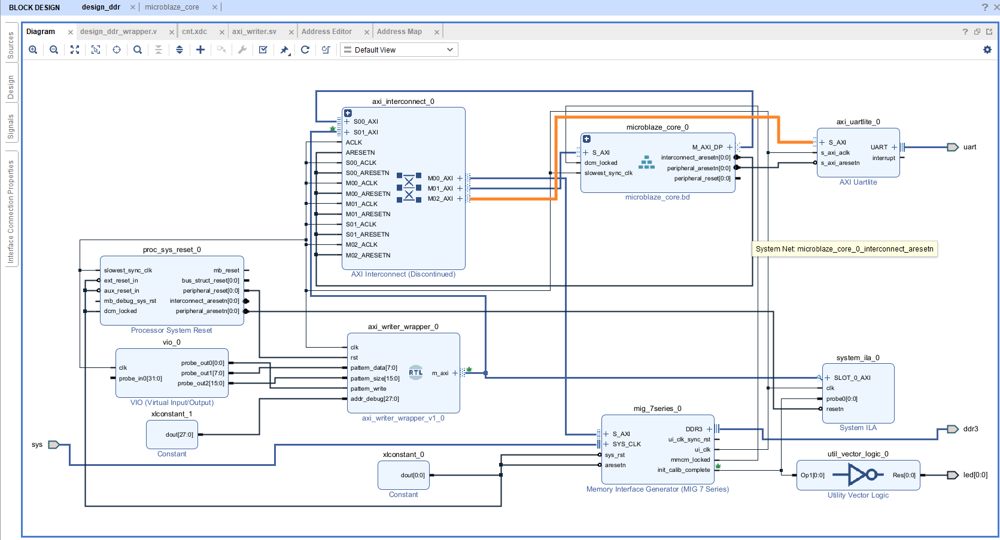
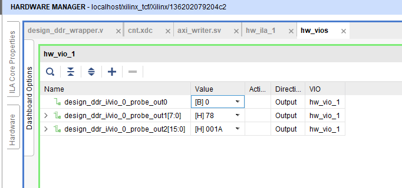
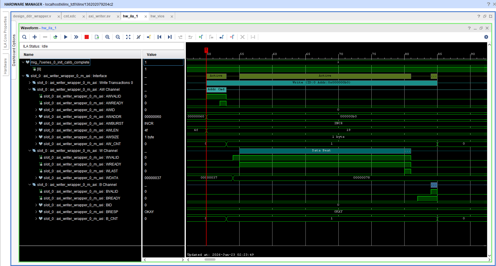
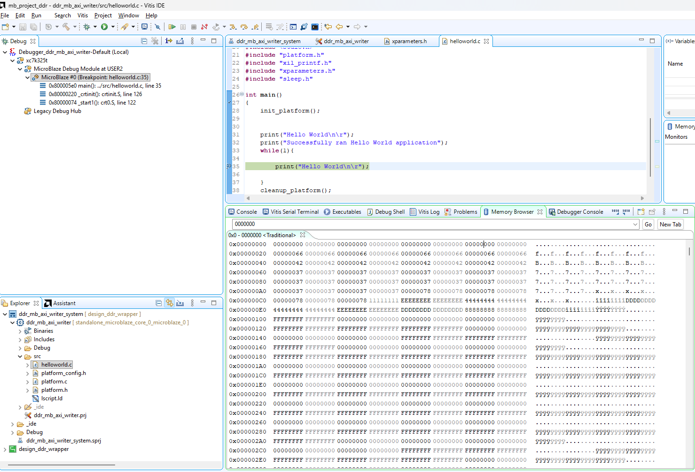

# Отладка на плате SITILINV

### Описание проекта

Проект содержит синтезируемое SystemVerilog IP-ядро axi\_writer, выполняющее запись блока данных в память по AXI-интерфейсу (только операции записи), а также данное ядро включено в общую схему с DDR3 и Microblaze.

### Основные параметры

Тактовая частота проекта: 200 МГц.

Размер памяти: 256 MB.

Максимальный размер берста 128.

### Работа алгоритма

На отладочной плате реализовано следующее:

1\. Запись данных в DDR3 напрямую по AXI-шине через блок axi\_writer

2\. Считывание данных из памяти DDR3 через Microblaze

### Проверки на отладочной плате

Для проверки использовалась отладочная плата SITILINV, представленная на рис. 1.

Для отслеживания корректности работы алгоритма были проделаны следующие шаги:

1\. Добавление и проверека работы DDR3 с первичной проверкой запуска через init_calib_complete двумя способами (привязка данного порта к светодиоду, а также добавлением ILA) 

2\. Подключение ядра microblaze и axi\_writer с DDR3 через AXI Interconnect

3\. Добавление блока VIO для изменения pattern\_data и pattern\_size, а также pattern\_write для проверки корректности работы, а также добавление блока ILA для наблюдения за транзакциями на отладочной плате

4\. Сборка общего проекта через Block Design и написание Verilog wrapper для axi\_writer согласно рис. 2.

5\. Написание скрипта на языке Си для отладки по microblaze через программу Vitis
Тестирование проводилось в программе Vitis и Vivado. Через Vivado настраивались pattern\_data и pattern\_size, а также pattern\_write, после чего проводилось наблюдение в ILA, а также в Vitis через Memory Browzer отслеживалось какие данные и какие адреса заполняются (согласно pattern\_data и pattern\_size)

Рис.1. Отладочная плата SITILINV

Рис.2. Block Design общего проекта

### Запуск проекта

1\. Открыть проект в Vivado через запуск test\_project.xpr.

2\. Убедиться, что файл axi\_writer добавлен в Design Sources.

3\. Убедиться, что файл tb\_axi\_writer добавлен в Simulation Sources.

4\. Убедиться, что файл ограничений .xdc добавлен в Constraints

5\. Открыть Block Design и выполнить проверку схемы:

а)открыть общий Block Design проекта;

б)выполнить Validate Design;

в)при необходимости выполнить Generate Output Products;

г)убедиться, что для Block Design создан HDL wrapper.

6\. Проверисти формирование битового потока для прошивки ПЛИС через Generate Bitstream (имя_файла.bit)

7\. Сформировать .xsa файл для Vitis через Vivado: File → Export Hardware (в настройке OUTPUT выбрать include bitstream)

Запустить Open Hardware Manager → Open Target → Auto connect.

8\. Запустить Vitis Classic, выбрать расположение workspace 

9\. Создать новый проект:

а)Create Application Project → Next → Create a new platform from hardware (XSA) → Browse (выбрать файл, который сформировали в п.6 )

б)Задать название проекта в поле Application project name → Next → Next → Выбрать шаблон Hello World → Finish

в)Собрать платформу и приложение:

г)выбрать проект платформы [Platform];

д)выполнить Build;

е)затем собрать application project.

ж)Найти в файле xparameters.h начальный адрес памяти DDR3

з)Добавить xparameters.h в Си код hello world

и)Подключить отладочную плату к компьютеру и включить питание.

к)В Vitis запустить Debug → Debug Configurations → Target Setup → Bitstream Files → Brows (выбрать сформированный файл .bit)
л)Запустить отладку на Microblaze

м)Запустить Window → Memory Browser

н)Отслеживать изменения адресов и значений по меняющимся адресам в соответствии с заданными параметрами pattern\_size и pattern\_data через VIO

### Результаты тестирования

Рис.3. Заданные параметры в VIO

Рис.4. Временные диаграммы AXI-транзакций, полученные через ILA

Рис. 5. Данные, записанные в DDR3 модулем axi_writer и считанные через MicroBlaze в Vitis

